# Security Testing Report
**Generated on:** November 9, 2025

---

## AutoScan-Front Screenshots

### 1. Missing Anti-clickjacking Header
**Category:** Clickjacking Protection - Missing Security Header

**Problem:**
The application is missing the X-Frame-Options or Content-Security-Policy header with frame-ancestors directive. This allows the page to be embedded in iframes, enabling clickjacking attacks.

**Reason:**
Without anti-clickjacking headers, attackers can load the application in an invisible iframe and trick users into clicking hidden elements, potentially leading to unauthorized actions.

**Solution:**
Add `X-Frame-Options: DENY` or `X-Frame-Options: SAMEORIGIN` header. Alternatively, use Content-Security-Policy with `frame-ancestors 'none'` or `frame-ancestors 'self'` directive to prevent framing attacks.

---

### 2. CSP: Failure to Define Directive with No Fallback
**Category:** Content Security Policy - Missing Directive Configuration

**Problem:**
The Content Security Policy (CSP) is missing critical directives without proper fallback configurations. This weakens the security posture and may allow certain types of attacks to succeed.

**Reason:**
When CSP directives are not properly defined, the browser cannot enforce security restrictions on content sources, leaving the application vulnerable to XSS and data injection attacks.

**Solution:**
Define all necessary CSP directives explicitly (script-src, style-src, img-src, etc.). Include a default-src directive as a fallback. Use strict policies like 'self' and avoid 'unsafe-inline' and 'unsafe-eval' whenever possible.

---

### 3. Mauvaise Configuration Inter-domaines (CORS)
**Category:** Cross-Origin Resource Sharing (CORS) Misconfiguration

**Problem:**
The application has improper Cross-Origin Resource Sharing (CORS) configuration, potentially allowing unauthorized domains to access resources or using overly permissive settings like `Access-Control-Allow-Origin: *`.

**Reason:**
Misconfigured CORS can expose sensitive data to malicious websites, allow unauthorized API calls from untrusted origins, and bypass Same-Origin Policy protections.

**Solution:**
Configure CORS properly by specifying exact allowed origins instead of wildcards. Use `Access-Control-Allow-Credentials: true` only with specific origins, never with `*`. Validate and whitelist trusted domains explicitly.

---

### 4. Server Leaks Information via "X-Powered-By" HTTP Response Header
**Category:** Information Disclosure - Server Technology Exposure

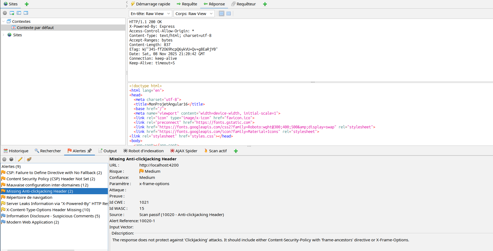

**Problem:**
The server reveals technology stack information through the X-Powered-By header (e.g., "X-Powered-By: Express", "PHP/7.4", etc.), exposing framework and version details to potential attackers.

**Reason:**
Disclosing server technology and versions helps attackers identify known vulnerabilities specific to those frameworks and plan targeted attacks against outdated or vulnerable components.

**Solution:**
Remove or suppress the X-Powered-By header. In Express.js use `app.disable('x-powered-by')`. In PHP set `expose_php = Off` in php.ini. Configure web servers (Nginx/Apache) to hide version information.

---

### 5. X-Content-Type-Options Header Missing
**Category:** MIME-Type Security - Missing Header Protection

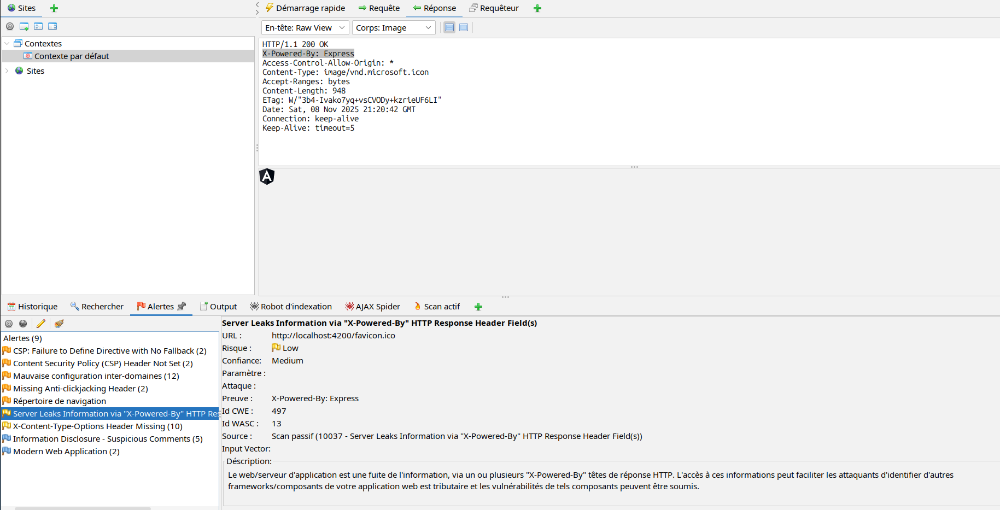

**Problem:**
The application does not set the X-Content-Type-Options header. This allows browsers to perform MIME-type sniffing, potentially interpreting files as a different type than declared.

**Reason:**
Without this header, browsers may execute content differently than intended. For example, a text file could be interpreted as JavaScript, or an image as HTML, leading to XSS vulnerabilities through content type confusion.

**Solution:**
Add the `X-Content-Type-Options: nosniff` header to all HTTP responses. This forces browsers to strictly follow the declared Content-Type and prevents MIME-sniffing attacks.

---

## ScanBackend Screenshots

### 7. actuatorTest.png
**Category:** Information Disclosure - Spring Boot Actuator Exposure

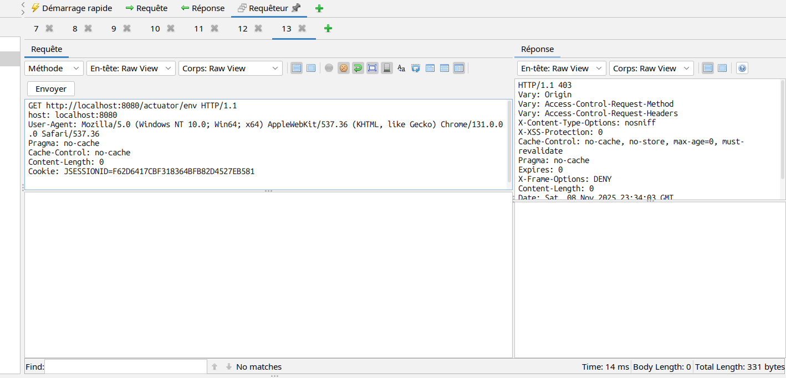

**Problem:**
The screenshot shows exposed Spring Boot Actuator endpoints that reveal sensitive application information and management capabilities.

**Description:**
Actuator API secured to hide configurations and database connection variables, as well as the application admin requires authentication to access these endpoints.

---

### 8. backend-graph-end points.png
**Category:** API Enumeration - GraphQL Endpoint Discovery

**Problem:**
This screenshot displays the GraphQL API endpoints structure, potentially showing the complete API schema and available operations.

**Reason:**
GraphQL introspection is enabled, allowing attackers to map the entire API surface and identify potential attack targets.

**Solution:**
Disable GraphQL introspection in production environments. Implement query depth limiting and complexity analysis to prevent resource exhaustion attacks.

---

### 9. backend-schema-shown.png
**Category:** Information Disclosure - Database Schema Exposure

**Problem:**
The screenshot reveals the backend database schema structure, exposing table names, relationships, and data organization.

**Reason:**
Schema information disclosure helps attackers craft targeted SQL injection attacks and understand data relationships for privilege escalation.

**Solution:**
Implement proper error handling to prevent schema leakage. Use ORM frameworks with parameterized queries and disable detailed error messages in production.

---

### 10. backend-test1.png
**Category:** Backend Security Testing - Initial Vulnerability Assessment

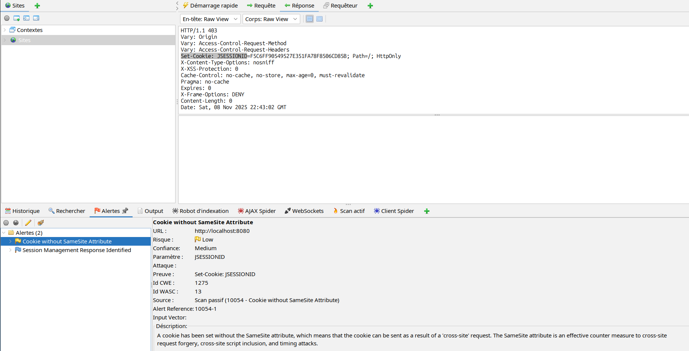

**Problem:**
This screenshot shows initial backend testing, likely identifying authentication, authorization, or input validation weaknesses.

**Reason:**
Backend systems often contain business logic flaws, broken access controls, or insufficient input validation that can be exploited.

**Solution:**
Implement robust authentication and authorization checks. Use frameworks like Spring Security with role-based access control (RBAC) and validate all inputs server-side.

---

### 11. deepQueryBackend.png
**Category:** Denial of Service - Deep Query Attack

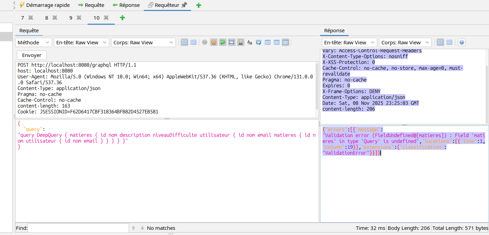

**Problem:**
This screenshot demonstrates a deep query attack against the backend, potentially causing performance degradation or service disruption.

**Reason:**
GraphQL allows nested queries that can exponentially increase processing time and memory consumption, leading to DoS conditions.

**Solution:**
Implement query depth limiting (max depth: 3-5 levels). Add query complexity analysis and rate limiting to prevent resource exhaustion attacks.

---

### 12. deepQueryExtreme.png
**Category:** Denial of Service - Extreme Deep Query Exploitation

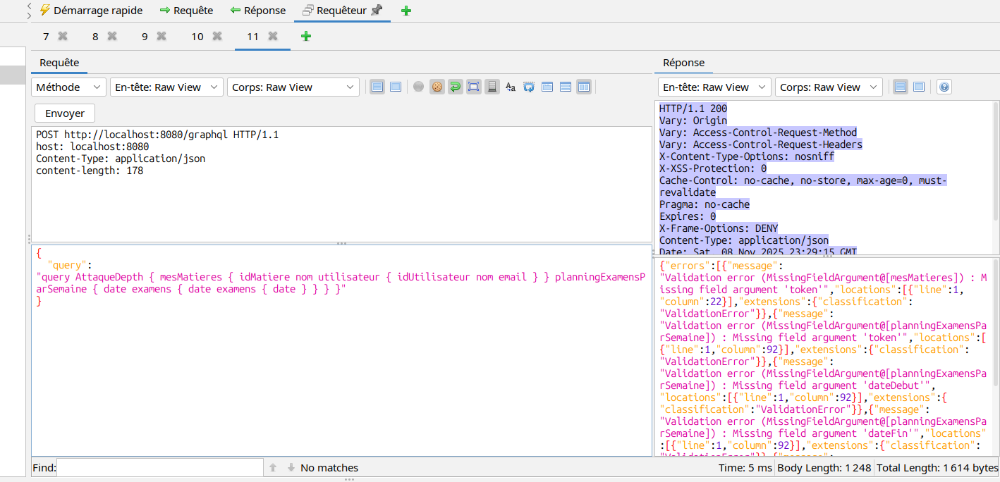

**Problem:**
This screenshot shows an extreme deep query attack, demonstrating maximum exploitation of nested query vulnerabilities.

**Reason:**
Without proper query complexity controls, attackers can craft queries with extreme nesting that overwhelm server resources.

**Solution:**
Use libraries like `graphql-depth-limit` and `graphql-validation-complexity`. Set maximum query depth to 5 and implement timeout mechanisms for long-running queries.

---

### 13. introcepction_query.png
**Category:** Information Disclosure - GraphQL Introspection

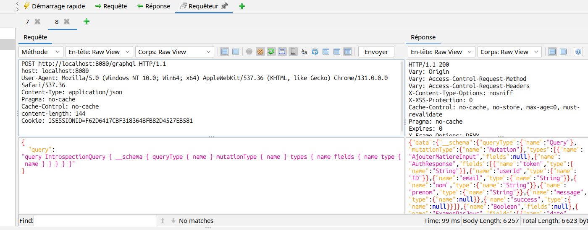

**Problem:**
This screenshot shows GraphQL introspection queries revealing the complete API schema, types, and available mutations.

**Reason:**
Introspection is a GraphQL feature that allows anyone to query and discover the entire API structure without authentication.

**Solution:**
Disable introspection in production: `graphql.playground.enabled=false` and `graphql.introspection.enabled=false`. Use schema stitching only for authorized clients.

---

### 14. jwtTokenTest.png
**Category:** Authentication Bypass - JWT Token Vulnerability

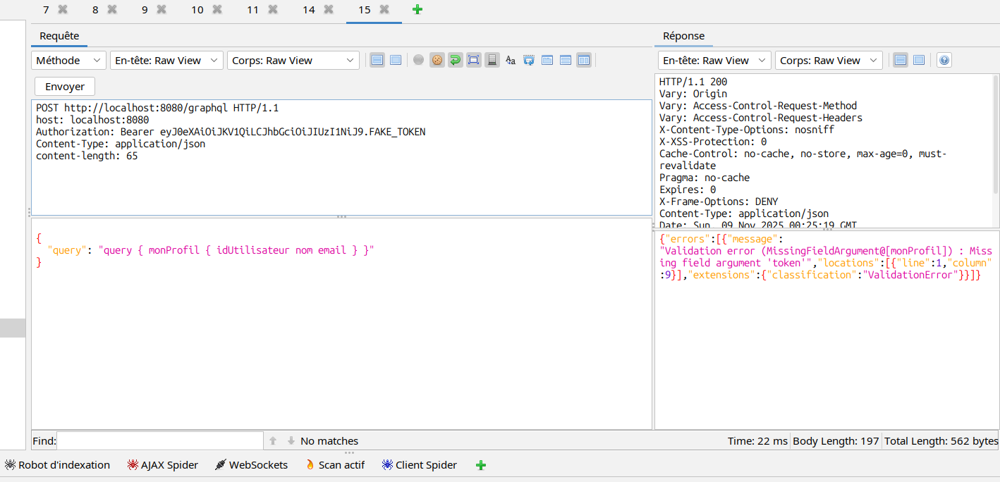

**Problem:**
This screenshot demonstrates JWT token manipulation or validation bypass, allowing unauthorized access to protected resources.

**Reason:**
Weak JWT implementation may allow token forgery, algorithm confusion attacks, or acceptance of unsigned tokens.

**Solution:**
Use strong signing algorithms (RS256 instead of HS256). Validate token signature, expiration, and claims rigorously. Never trust client-provided algorithm headers.

---

### 15. sqlinjectionRowAdd.png
**Category:** SQL Injection - Data Manipulation

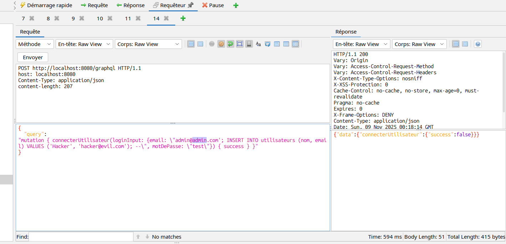

**Problem:**
This screenshot shows successful SQL injection attack adding unauthorized rows to the database.

**Reason:**
The application directly concatenates user input into SQL queries without proper sanitization or parameterization.

**Solution:**
Use prepared statements and parameterized queries exclusively. Implement ORM frameworks like JPA/Hibernate with proper configuration. Never concatenate user input into SQL.

---

### 16. sqlInjectionUnion.png
**Category:** SQL Injection - Union-Based Data Extraction

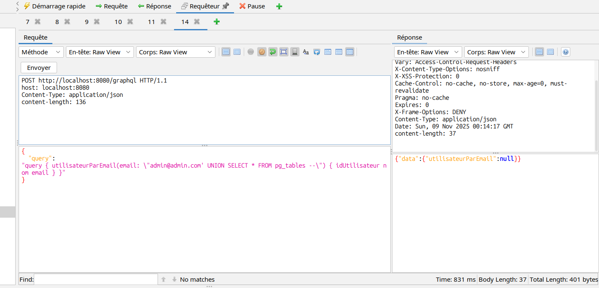

**Problem:**
This screenshot demonstrates UNION-based SQL injection extracting sensitive data from database tables.

**Reason:**
Lack of input validation allows attackers to append UNION SELECT statements to extract data from other tables or columns.

**Solution:**
Implement strict input validation and whitelist allowed characters. Use ORM frameworks with prepared statements. Apply least privilege principle for database accounts.

---

## Additional Files

### 17. validator.png
**Category:** Input Validation Testing

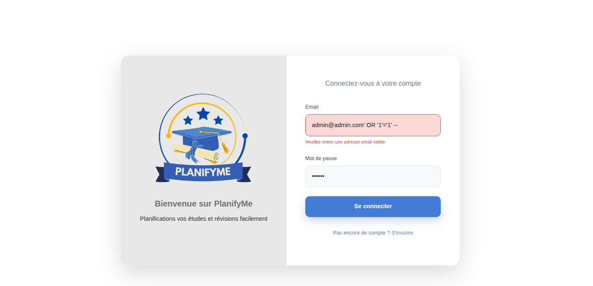

**Problem:**
This screenshot likely shows validation testing results, possibly demonstrating bypasses in input validation mechanisms.

**Reason:**
Client-side validation alone is insufficient as it can be bypassed. Server-side validation must verify all inputs.

**Solution:**
Implement comprehensive server-side validation for all user inputs. Use validation frameworks like Hibernate Validator with custom constraints for complex rules.

---

## Summary of Findings

### Critical Vulnerabilities (Immediate Action Required)
1. **SQL Injection** - Multiple attack vectors demonstrated
2. **JWT Token Vulnerabilities** - Authentication bypass possible
3. **GraphQL Introspection Enabled** - Complete API disclosure

### High Severity Issues
1. **Spring Boot Actuator Exposure** - Management endpoints accessible
2. **Deep Query DoS Attacks** - Service disruption possible
3. **Database Schema Disclosure** - Information leakage

### Medium Severity Issues
1. **Input Validation Weaknesses** - Various bypass techniques
2. **Frontend Security Gaps** - Client-side vulnerabilities

### Recommended Priority Actions

1. **Immediate (Within 24 hours):**
   - Disable GraphQL introspection in production
   - Implement SQL injection prevention using prepared statements
   - Secure JWT token validation

2. **Short-term (Within 1 week):**
   - Implement query depth and complexity limiting
   - Secure Spring Boot Actuator endpoints
   - Add comprehensive input validation

3. **Medium-term (Within 1 month):**
   - Conduct security code review
   - Implement automated security testing in CI/CD
   - Add Web Application Firewall (WAF)

---

## Conclusion

The security testing revealed multiple critical vulnerabilities across both frontend and backend components. The most severe issues involve SQL injection, authentication bypass, and information disclosure through GraphQL introspection. Immediate remediation is required to prevent data breaches and service disruptions.

**Next Steps:**
- Prioritize fixes based on severity ratings
- Implement security testing in development pipeline
- Schedule follow-up penetration testing after remediation
- Provide security training for development team

---

*This report is based on screenshot analysis and should be verified with actual vulnerability testing tools and manual code review.*
